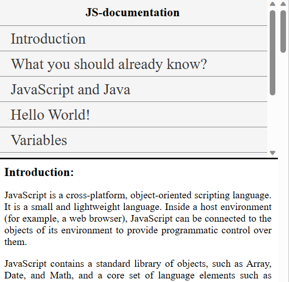

# JS Documentation

Welcome to the JS Documentation project! This is a static documentation page for JavaScript, created using only HTML and CSS. It provides a structured and comprehensive guide to various JavaScript topics.

## Features

- **Introduction to JavaScript**: Covers basic information about JavaScript as a cross-platform, object-oriented scripting language.
- **JavaScript vs Java**: Highlights the similarities and differences between JavaScript and Java.
- **Code Examples**: Includes simple JavaScript code examples like "Hello World!".
- **Variables and Constants**: Detailed explanation of how to declare and use variables and constants in JavaScript.
- **References**: Links to further documentation and resources on MDN Web Docs.

## Technologies Used

- HTML
- CSS

## Preview

